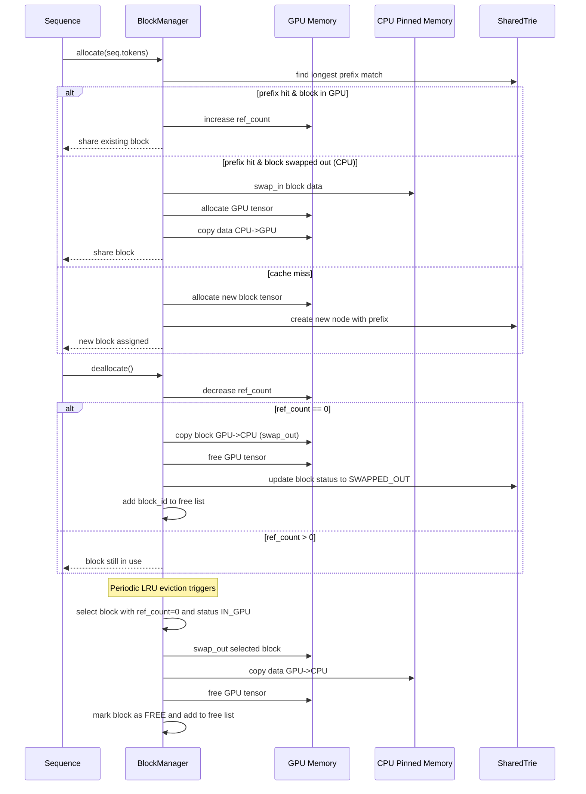
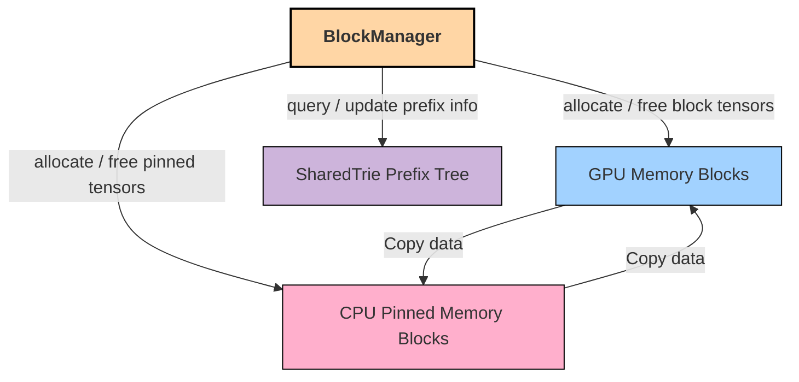

# Nano-SGLang

A lightweight SGLang implementation built from scratch.

## 🚀 BlockManager Highlights

- 🌲 **Trie-based Prefix Sharing**  
  Efficiently reuses KV cache blocks for shared token prefixes across sequences.

- ✂️ **Copy-on-Write with Triton Kernel**  
  Cleanly handles divergence by copying only the shared prefix with optimized kernel.

- 🧠 **Two-Level Memory (GPU + Pinned CPU)**  
  Automatically swaps blocks between VRAM and pinned RAM to reduce GPU pressure.

- ♻️ **LRU Eviction Strategy**  
  Frees unused blocks intelligently based on least recently used (LRU) policy.

- 🧱 **Modular Hardware Abstraction Layer**  
  Clean separation of memory management, allocation, and data movement.

- 📦 **Sequence-Friendly Design**  
  Supports streaming with `allocate()`, `can_append()`, `may_append()`, and safe deallocation.

- 🧾 **Debuggable & Transparent**  
  Includes detailed logging and a `print_state()` function for internal visibility.

## Installation

```bash
pip install git+https://github.com/YangCao28/nano-SGLang.git
```

## Manual Download

If you prefer to download the model weights manually, use the following command:
```bash
huggingface-cli download --resume-download Qwen/Qwen3-0.6B \
  --local-dir ~/huggingface/Qwen3-0.6B/ \
  --local-dir-use-symlinks False
```

## Quick Start

See `example.py` for usage. The API mirrors vLLM's interface with minor differences in the `LLM.generate` method:
```python
from nanovllm import LLM, SamplingParams
llm = LLM("/YOUR/MODEL/PATH", enforce_eager=True, tensor_parallel_size=1)
sampling_params = SamplingParams(temperature=0.6, max_tokens=256)
prompts = ["Hello, Nano-vLLM."]
outputs = llm.generate(prompts, sampling_params)
outputs[0]["text"]
```

## 🔄 BlockManager Allocation Flow



